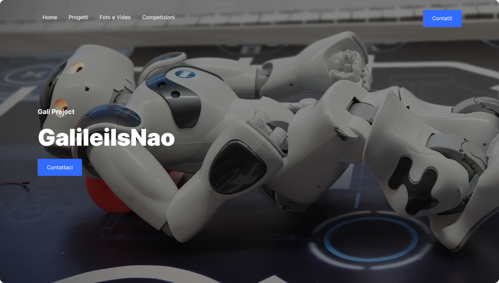
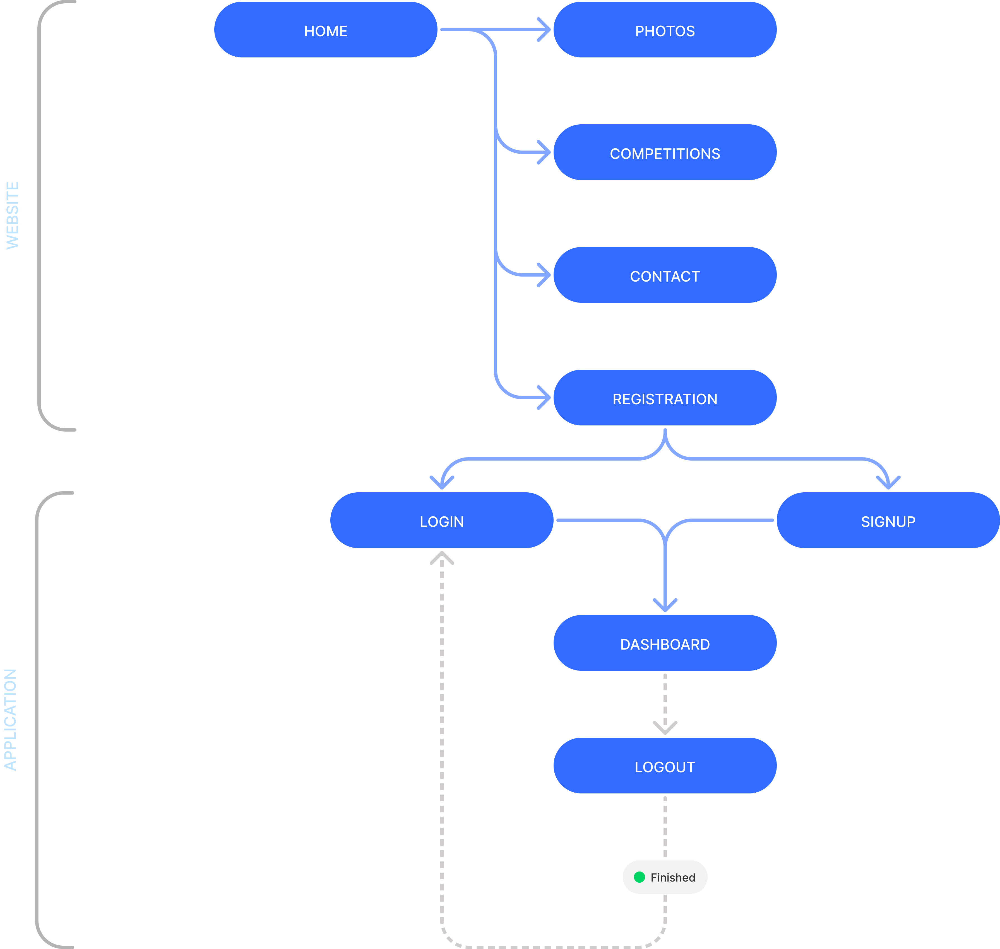
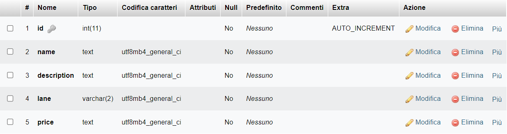
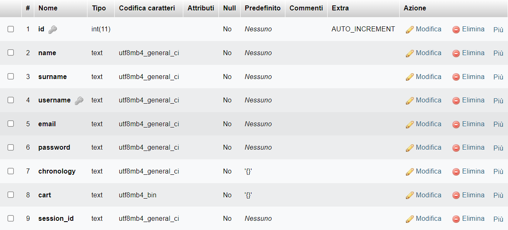
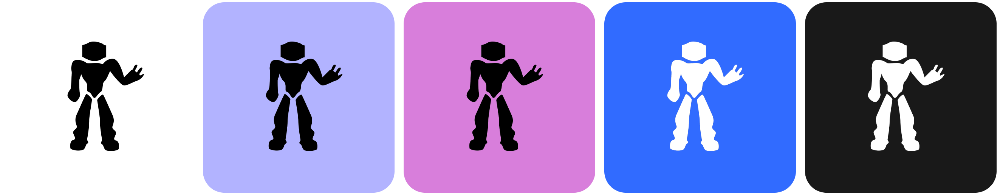

# Relazione

## Indice
- [Overview](#overview)
- [NAO](#nao)
- [Development](#development)
    - [Website](#website)
    - [Socket](#socket)
    - [API](#api)
 - [Design](#design)
 - [Partner](#partner)


## Overview
Il progetto di quest'anno presentato dall'istituto Galilei di Mirandola. 
Il sistema di e-commerce gestito da un robot NAO si configura come un'innovativa soluzione che unisce l'interattività uomo-macchina con la comodità e l'efficienza degli acquisti online. Il sistema favorisce anche coloro che a causa di disabilità riscontrano problemi nello svolgimento di attività di medesimo tipo, garantendo così a determinate categorie di cittadini maggior autonomia ed emancipazione nella società odierna. Ecco come funzionerebbe:

### Interfaccia utente
Il robot NAO funge da interfaccia tra l'utente e il sistema di e-commerce. Utilizzando il un sistema di autenticazione, il robot è in grado di identificare gli utenti e personalizzare l'esperienza di acquisto in base ai loro gusti e alle loro preferenze. Può anche rispondere a domande, fornire consigli sui prodotti e assistere durante il processo di acquisto.

### Interfaccia digitale
Accanto al robot NAO, c'è una piattaforma digitale web accessibile agli utenti tramite browser. Questa piattaforma consente loro di visualizzare i prodotti disponibili, la cronologia degli acquisti e il carrello.

#### Funzionalità per i clienti
- **Visualizzazione dei prodotti**: Gli utenti possono navigare attraverso una vasta gamma di prodotti suddivisi in categorie. Possono utilizzare filtri e criteri di ricerca per trovare rapidamente ciò che cercano.

- **Cronologia degli acquisti**: Gli utenti possono accedere alla loro cronologia di acquisti passati, facilitando il riacquisto di prodotti preferiti o il monitoraggio dei loro acquisti nel tempo.

- **Carrello**: Gli utenti possono aggiungere prodotti al carrello e gestire facilmente gli articoli prima di procedere al pagamento.

#### Funzionalità per gli amministratori
- **Dati di vendita**: Gli amministratori hanno accesso a una dashboard che fornisce dati dettagliati sulle vendite, inclusi grafici e report analitici. Possono monitorare le prestazioni dei prodotti, l'andamento delle vendite nel tempo e altre metriche cruciali per il business.

- **Gestione dei prodotti**: Gli amministratori possono aggiungere nuovi prodotti, modificare le descrizioni, regolare i prezzi e gestire l'inventario direttamente dalla piattaforma web.

### Processo di acquisto
Quando un utente desidera effettuare un acquisto, può interagire con il robot NAO o utilizzare la piattaforma digitale web. Una volta che l'utente ha selezionato i prodotti desiderati e li ha aggiunti al carrello, può procedere al checkout. Durante questo processo, l'utente può scegliere il metodo di pagamento preferito e confermare l'ordine.


## NAO
L’interazione tra Nao e Raspberry ci ha consentito di creare un programma in grado di accompagnare i clienti del nostro partner alla locazione del prodotto che cercano. L’utente può richiedere la posizione di un prodotto tramite ricerca vocale oppure mostrando l’immagine o il NaoMark del prodotto, tutte stampe plastificate che verranno messe a disposizione all’ingresso del vivaio. In seguito al riconoscimento se il cliente vorrà essere accompagnato, il Nao invierà il nome del suddetto tramite socket al Raspberry che possiede già al suo interno le posizioni dei vari prodotti. Elaborerà i dati e invierà il percorso da seguire al Nao. Ciò è possibile perché nel mentre il robot si guarderà intorno dove saranno appesi ulteriori NaoMark che gli consentiranno di orientarsi e conoscere la sua posizione all’interno del negozio. Se altrimenti il cliente non desiderasse essere accompagnato, il Nao darà solo informazioni sulla corsia. La vera rivoluzione del nostro progetto è la possibilità di poter usufruire di un carrello virtuale accessibile tramite un fantastico personal shopper. Il cliente, dopo essere stato accompagnato, potrà decidere se usufruire di quest’opportunità, ma solo se registrato sul nostro sito.


## Development
<h3 align="center" id="website">Website • <a href="https://www.galileiisnao.it/" target="_blank">Gali's website</a></h3>

<p align="center">
    <a href="#overview">Overview</a> |
    <a href="#development">Development</a>
</p>

<p align="center">  
    
</p>

___

### Overview
Questo repository contiene il codice sorgente per il nuovo sito [NAO](https://www.galileiisnao.it/) . Il sito è scritto utilizzando [Angular](https://angular.io/), [TypeScript](https://www.typescriptlang.org/) e css.

Il sito permette di interfacciarsi direttamente con il sistema di e-commerce oltre ad avere un aggiornamento in tempo reale delle operazioni del Nao.
L'amministratore ha inoltre una pagina dedicata in cui potrà visualizzare dei dati analitici in real-time.

Il sito ha infine una funzione di manifesto, infatti raccoglie foto di competizioni passate.

#### Development
1. **Clona la repository**:
    ```ps
    git clone https://github.com/GalileiIsNao-2024/website.git && cd website
    ```
    Ciò creerà una copia locale di questo repository e ti porterà alla cartella principale del repository.

2. Installa le dipendenze
    ```ps
    npm i
    ```

3. Esegui lo script
    ```ps
    ng serve
    ```

### Codebase Structure
```
/website
│
├── /php
│   ├── /auth
│   │   ├── session.php
│   │   └── user.class.php
│   └── db_connection.php
│
├── /src
│   ├── /app
│   │   ├── /app
│   │   │   ├── /components
│   │   │   │   └── /header
│   │   │   │
│   │   │   └── /pages
│   │   │       ├── /signin
│   │   │       ├── /signup
│   │   │       └── /dashboard
│   │   │
│   │   ├── /website
│   │   │   ├── /components
│   │   │   │   ├── /header
│   │   │   │   └── /footer
│   │   │   │
│   │   │   └── /pages
│   │   │       ├── /index
│   │   │       ├── /photos
│   │   │       └── /competitions
│   │   │
│   │   ├── app.component.html
│   │   ├── app.component.css
│   │   ├── app.component.spec.ts
│   │   └── app.component.ts
│   │
│   ├── /assets
│   │   ├── /avatars
│   │   ├── /icons
│   │   ├── /img
│   │   └── /photos
│   │
│   ├── index.html
│   ├── main.ts
│   └── styles.css
│
├── angular.json
├── tsconfig.json
├── package.json
└── tsconfig.spec.json

```

### Application Routing
```
{
    "/"                → home
    "/photos"          → raccolta foto
    "/competitions"    → descrizioni di competizioni precedenti
    "/singin"          → accesso
    "/singup"          → registrazione
    "/dashboard"       → tabella e grafici dei dati
}
```

### Userflow
<p align="center">  
    
</p>

___

<h3 align="center" id="socket">Socket</h3>
Il codice fornito implementa un server socket in Python utilizzando il modulo socket e threading per consentire la comunicazione bidirezionale tra il server e un client attraverso una connessione TCP.

#### Analisi
1. **Moduli**:
    - `socket` viene utilizzato per la gestione delle connessioni di rete.
    - `time` viene importato per utilizzare la funzione `ctime()` per ottenere il tempo corrente.
    - `threading` viene utilizzato per gestire i thread multipli e consentire la comunicazione simultanea con il client.

2. **Inizializzazione del codice**:
    ```python
    sADDR = ("", 45002)
    buff = 1024

    servSock = socket.socket(socket.AF_INET, socket.SOCK_STREAM)
    servSock.bind(sADDR)
    servSock.listen(5)
    ```
    - `sADDR` rappresenta l'indirizzo IP del server e la porta sulla quale il server rimane in ascolto per le connessioni in entrata. Lasciando il valore dell'indirizzo vuoto i dati del server verranno mandati direttamente al dispositivo richiedente.
    - `buff` definisce la dimensione dei dati
    - `servSock` è il socket del server, viene inizializzato utilizzando `socket.socket()` specificando `AF_INET` per l'indirizzo IP e `SOCK_STREAM` per il tipo di socket TCP.
    - Il server si mette in ascolto su sADDR utilizzando il metodo bind() e listen().

3. **Accettazione della connessione**:
    ```python
    cliSock, cADDR = servSock.accept()
    ```
    Il server si mette in attesa di connessioni in arrivo utilizzando `servSock.accept()`.

4. **Funzioni di invio e ricezione**:
    ```python
    def receive():
        while True:
            rMessage = cliSock.recv(buff)
            if not rMessage:
                print("Ending connection")
                break
            print("[{0}]: {1}".format(ctime(), rMessage.decode('utf-8')))

    def send():
        while True:
            sMessage = input(">>")
            if not sMessage:
                break
            cliSock.send(sMessage.encode('utf-8'))
    ```
    - La funzione `receive()` è un thread che riceve i messaggi dal client tramite `cliSock.recv()` e li stampa a schermo. Se il messaggio ricevuto è vuoto, la connessione viene chiusa.
    - La funzione `send()` è un thread che acquisisce l'input dall'utente attraverso `input()` e invia il messaggio al client tramite `cliSock.send()`. Se l'input è vuoto, il ciclo termina.

5. **Avvio dei thread**:
    ```python
    t1 = threading.Thread(target=send, name=3)
    t2 = threading.Thread(target=receive, name=4)

    t1.start()
    t2.start()
    ```
    - Vengono creati due oggetti thread `t1` e `t2`, ciascuno associato a una delle due funzioni di invio e ricezione.
    - I thread vengono avviati utilizzando il metodo `start()`, consentendo loro di eseguire le rispettive funzioni in modo concorrente.

#### Conclusione
Il codice implementa con successo un server socket che consente la comunicazione bidirezionale con un client attraverso una connessione TCP. L'utilizzo di thread separati per la ricezione e l'invio dei messaggi consente al server di gestire più connessioni simultaneamente. 

> [!WARNING]
> Il codice non include gestione degli errori, che potrebbe essere necessaria per garantire una maggiore robustezza e sicurezza dell'applicazione.

___

<h3 align="center" id="api">API</h3>
Questo algoritmo permette al Nao di comunicare con i database in modo da poter leggere e modificare i dati sul sito in tempo reale.

## 🛜Funzionamento
Il Nao si collega, dopo essersi autenticato con una password. Questo ci permette di conoscere da quale dispositivo viene effettuata qualsiasi operazione.

## ⚙️Funzionalità

### Lista totale degli utenti
- Input:
    ```json
    {
        "password": "",
        "request": "allUsers"
    }
    ```
- Output:
    ```json
    ["user_1", "user_2"]
    ```

### Posizione degli oggetti
La funzione ritorna la corsia dell'oggetto.
- Input:
    ```json
    {
        "password": "",
        "request": "objectPosition",
        "product": "object"
    }
    ```
- Output:
    ```json
    3 // numero della corsia
    ```

### Aggiungi al carrello
- Input:
    ```json
    {
        "password": "",
        "request": "addToCart",
        "user": "galileiisnao",
        "product": "rosa"
    }
    ```
- Output:
    ```json
    true || false
    ```

### Checkout
Questa funzione si occupa dell'ultima fase dell'acquisto. Si occuperà dello svuotamento del carrello e lo aggiungerà alla lista degli acquisti precedenti.
- Input:
    ```json
    {
        "password": "",
        "request": "checkout",
        "user": "galileiisnao",
    }
    ```
- Output:
    ```json
    {
        "total": 0.00
    }
    ```

## 📊Struttura del database
Tables:
- `products`:

    

- `users`:

    


## Design
Il logo di quest'anno rappresenta un cerchio bianco con una linea nera che lo attraversa orizzontalmente. All'interno del cerchio, ci sono le lettere "NAO". Il carattere tipografico utilizzato per le lettere è un sans-serif moderno.

Il logo è semplice e minimalista. I colori utilizzati sono il bianco, il blu e il verde.
Il logo è efficace perché è facile da ricordare e da riconoscere. I colori utilizzati sono semplici e puliti e il carattere tipografico è moderno e accattivante.


## Carrello
Alcuni ragazzi della nostra squadra hanno sviluppato e costruito una piattaforma mobile idealizzata per affiancare coloro che sono affetti da disbilità psichiche e sensoriali come ad esempio cecità; detto ciò, la funzione primaria del dispositivo è quella di accompagnare l’utente verso il prodotto che sta cercando, in modo da rendere più efficienti gli spostamenti e i sevezi dal commesso offerti . 
Da una recente indagine statistica è stato dimostrato che nel 34% dei negozi all'inetrno suolo nazionale , molti comsumatori riscontrano una situazione di disagio dovuta a lunghi tempi di attesa e ad un servizio carente in cui la presenza del venditore o di chi ne fa le veci è insufficiente e poco attenta a causa di grandi carichi di lavoro.
Il carrellino è composto da uno scheletro realizzato con un  profilato metallico e delle giunzioni in legno, ai quali sono stati aggiunte parti di carpenteria metallica e dei supporti con lo scopo di garantire il giusto alloggiamento e la stabilità di tutta la componentistica come le ruote multidirezionali anteriori e posteriori e quelle motrici , monofase laterali.
Codesti sostegni sono porgettati attraverso il software di modellazione e progettazione 3d , Fusion 360 e poi riprodotti in PLA 1,75 mm² con una stampante 3D Flashforge Guider 2s. 
Tra i dispositivi elettronici presenti vi è un sensore ad ultrasuoni,  ideato in modo che possa compiere una ruotazione di circa 180 gradi, grazie ad un servomotore, per avere un ampio raggio di rilevamento delle distanze ed il pieno controllo di eventuali ostacoli che potrebbero ostruire il passaggio della piattaforma stessa.  
Il resto della componentistica prevede un ponte H, un microprocessore raspberry, una breadboard, una batteria da 12 V, un pulsante id accensione bistabile ed un microcontrollore arduino; tutto collegato tramite fili conduttori con estremità sia di tipo maschio che femmina e dei connettori Faston.


## Partner


Quest’anno abbiamo deciso di risolvere un problema legato ad un vivaio nella nostra zona: il vivaio Morselli, a Medolla. É una serra di $30000 m^2$ in cui è possibile trovare un'enorme varietà di piante, fiori, oggetti da giardino e persino attrezzatura per la piscina. Il nostro progetto nasce dalla volontà di dare una mano agli addetti, in modo che possano concentrarsi su altre attività, lasciando a Nao il compito di fornire informazioni e indicazioni ai clienti sulla posizione dei prodotti.


# Thanks for scrolling!
<p align="center">  
    
</p>

## Social
- [Instagram](https://www.instagram.com/galileisnao/)
