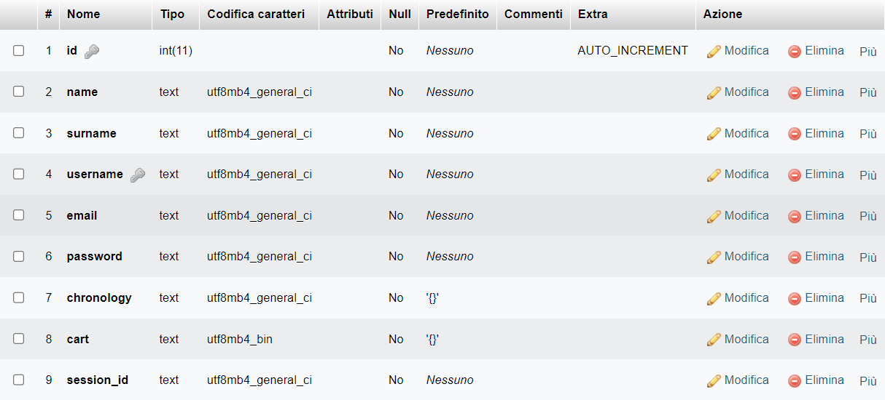

# Relazione

## Indice
- [Overview](#overview)
- [Development](#development)

## Overview
Il progetto di quest'anno presentato dall'istituto Galilei di Mirandola. Il sistema consiste nella sostituzione di un dipendente da parte del Nao.

## Development
<h3 align="center">Website • <a href="https://www.galileiisnao.it/" target="_blank">Gali's website</a></h3>

<p align="center">
    <a href="#overview">Overview</a> |
    <a href="#development">Development</a>
</p>

<p align="center">  
    
</p>

___

### Overview
Questo repository contiene il codice sorgente per il nuovo sito [NAO](https://www.galileiisnao.it/) . Il sito è scritto utilizzando [Angular](https://angular.io/), [TypeScript](https://www.typescriptlang.org/) e css.

Il sito permette di interfacciarsi direttamente con il sistema di e-commerce oltre ad avere un aggiornamento in tempo reale delle operazioni del Nao.
L'amministratore ha inoltre una pagina dedicata in cui potrà visualizzare dei dati analitici in real-time.

Il sito ha infine una funzione di manifesto, infatti raccoglie foto di competizioni passate.

#### Development
1. **Clona la repository**:
    ```ps
    git clone https://github.com/GalileiIsNao-2024/website.git && cd website
    ```
    Ciò creerà una copia locale di questo repository e ti porterà alla cartella principale del repository.

2. Installa le dipendenze
    ```ps
    npm i
    ```

3. Esegui lo script
    ```ps
    ng serve
    ```

### Codebase Structure
```
/website
│
├── /php
│   ├── /auth
│   │   ├── session.php
│   │   └── user.class.php
│   └── db_connection.php
│
├── /src
│   ├── /app
│   │   ├── /app
│   │   │   ├── /components
│   │   │   │   └── /header
│   │   │   │
│   │   │   └── /pages
│   │   │       ├── /signin
│   │   │       ├── /signup
│   │   │       └── /dashboard
│   │   │
│   │   ├── /website
│   │   │   ├── /components
│   │   │   │   ├── /header
│   │   │   │   └── /footer
│   │   │   │
│   │   │   └── /pages
│   │   │       ├── /index
│   │   │       ├── /photos
│   │   │       └── /competitions
│   │   │
│   │   ├── app.component.html
│   │   ├── app.component.css
│   │   ├── app.component.spec.ts
│   │   └── app.component.ts
│   │
│   ├── /assets
│   │   ├── /avatars
│   │   ├── /icons
│   │   ├── /img
│   │   └── /photos
│   │
│   ├── index.html
│   ├── main.ts
│   └── styles.css
│
├── angular.json
├── tsconfig.json
├── package.json
└── tsconfig.spec.json

```

### Application Routing
```
{
    "/"                → home
    "/photos"          → raccolta foto
    "/competitions"    → descrizioni di competizioni precedenti
    "/singin"          → accesso
    "/singup"          → registrazione
    "/dashboard"       → tabella e grafici dei dati
}
```

### Userflow
<p align="center">  
    
</p>

___

<h3 align="center">Socket</h3>
Il codice fornito implementa un server socket in Python utilizzando il modulo socket e threading per consentire la comunicazione bidirezionale tra il server e un client attraverso una connessione TCP.

#### Analisi
1. **Moduli**:
    - `socket` viene utilizzato per la gestione delle connessioni di rete.
    - `time` viene importato per utilizzare la funzione `ctime()` per ottenere il tempo corrente.
    - `threading` viene utilizzato per gestire i thread multipli e consentire la comunicazione simultanea con il client.

2. **Inizializzazione del codice**:
    ```python
    sADDR = ("", 45002)
    buff = 1024

    servSock = socket.socket(socket.AF_INET, socket.SOCK_STREAM)
    servSock.bind(sADDR)
    servSock.listen(5)
    ```
    - `sADDR` rappresenta l'indirizzo IP del server e la porta sulla quale il server rimane in ascolto per le connessioni in entrata. Lasciando il valore dell'indirizzo vuoto i dati del server verranno mandati direttamente al dispositivo richiedente.
    - `buff` definisce la dimensione dei dati
    - `servSock` è il socket del server, viene inizializzato utilizzando `socket.socket()` specificando `AF_INET` per l'indirizzo IP e `SOCK_STREAM` per il tipo di socket TCP.
    - Il server si mette in ascolto su sADDR utilizzando il metodo bind() e listen().

3. **Accettazione della connessione**:
    ```python
    cliSock, cADDR = servSock.accept()
    ```
    Il server si mette in attesa di connessioni in arrivo utilizzando `servSock.accept()`.

4. **Funzioni di invio e ricezione**:
    ```python
    def receive():
        while True:
            rMessage = cliSock.recv(buff)
            if not rMessage:
                print("Ending connection")
                break
            print("[{0}]: {1}".format(ctime(), rMessage.decode('utf-8')))

    def send():
        while True:
            sMessage = input(">>")
            if not sMessage:
                break
            cliSock.send(sMessage.encode('utf-8'))
    ```
    - La funzione `receive()` è un thread che riceve i messaggi dal client tramite `cliSock.recv()` e li stampa a schermo. Se il messaggio ricevuto è vuoto, la connessione viene chiusa.
    - La funzione `send()` è un thread che acquisisce l'input dall'utente attraverso `input()` e invia il messaggio al client tramite `cliSock.send()`. Se l'input è vuoto, il ciclo termina.

5. **Avvio dei thread**:
    ```python
    t1 = threading.Thread(target=send, name=3)
    t2 = threading.Thread(target=receive, name=4)

    t1.start()
    t2.start()
    ```
    - Vengono creati due oggetti thread `t1` e `t2`, ciascuno associato a una delle due funzioni di invio e ricezione.
    - I thread vengono avviati utilizzando il metodo `start()`, consentendo loro di eseguire le rispettive funzioni in modo concorrente.

#### Conclusione
Il codice implementa con successo un server socket che consente la comunicazione bidirezionale con un client attraverso una connessione TCP. L'utilizzo di thread separati per la ricezione e l'invio dei messaggi consente al server di gestire più connessioni simultaneamente. 

> [!WARNING]
> Il codice non include gestione degli errori, che potrebbe essere necessaria per garantire una maggiore robustezza e sicurezza dell'applicazione.

___

<h3 align="center">API</h3>
Questo algoritmo permette al Nao di comunicare con i database in modo da poter leggere e modificare i dati sul sito in tempo reale.

## 🛜Funzionamento
Il Nao si collega, dopo essersi autenticato con una password. Questo ci permette di conoscere da quale dispositivo viene effettuata qualsiasi operazione.

## ⚙️Funzionalità

### Lista totale degli utenti
- Input:
    ```json
    {
        "password": "",
        "request": "allUsers"
    }
    ```
- Output:
    ```json
    ["user_1", "user_2"]
    ```

### Posizione degli oggetti
La funzione ritorna la corsia dell'oggetto.
- Input:
    ```json
    {
        "password": "",
        "request": "objectPosition",
        "product": "object"
    }
    ```
- Output:
    ```json
    3 // numero della corsia
    ```

### Aggiungi al carrello
- Input:
    ```json
    {
        "password": "",
        "request": "addToCart",
        "user": "galileiisnao",
        "product": "rosa"
    }
    ```
- Output:
    ```json
    true || false
    ```

### Checkout
Questa funzione si occupa dell'ultima fase dell'acquisto. Si occuperà dello svuotamento del carrello e lo aggiungerà alla lista degli acquisti precedenti.
- Input:
    ```json
    {
        "password": "",
        "request": "checkout",
        "user": "galileiisnao",
    }
    ```
- Output:
    ```json
    {
        "total": 0.00
    }
    ```

## 📊Struttura del database
Tables:
- `products`:

    

- `users`:

    


# Thanks for scrolling!
<p align="center">  
    
</p>
